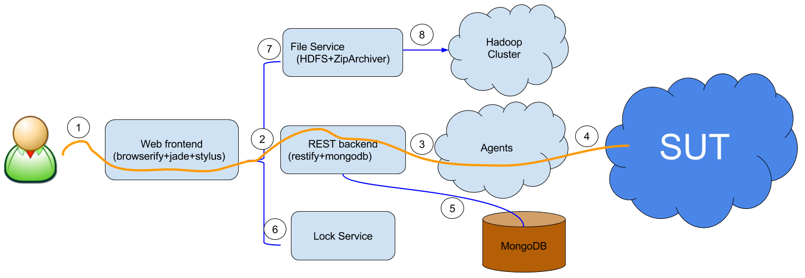

<!-- TOC depth:6 withLinks:1 updateOnSave:1 orderedList:0 -->

- [Lybica](#lybica)
	- [Application Architecture](#application-architecture)
	- [File Tree](#file-tree)
	- [Deployment](#deployment)
		- [Requirements](#requirements)
			- [lybica-web](#lybica-web)
			- [lybica-platform](#lybica-platform)
			- [lybica-runner](#lybica-runner)
<!-- /TOC -->
# Lybica

`Lybica` is platform designed for large software testing and delivery.

## Application Architecture

The application architecture is illustrated as below:



1. The website is the only interface for the user until now.
1. The website communicate with backend services via RESTful API.
1. Agents running on execution nodes will communicate with backend services, and execute the tasks.
1. Agent will start `runner` to execute the task, and the runner will communicate with the `SUT` (system under testing).
1. `MongoDB` is used as the primary database.
1. Unified lock services is optional.
1. The huge logs generated during tasks will be saved with `File Service`, it may provide HDFS backed to store, the `File Service` will communicate with Hadoop clusters.

## File Tree

```
.
├── assets
├── atest
├── lybica-platform
├── lybica-runner
├── lybica-web
└── ptest
└── Makefile
```

1. `Makefile` is the entry point of atest, ptest and deployment.
1. `atest` contains acceptance test cases.
1. `ptest` contains performance test cases.
1. `lybica-platform` is the submodule of API provider Service.
1. `lybica-web` is the submodule of web UI service.
1. `lybica-runner` is the submodule of task execution scripts.

## Deployment

### Requirements

1. Linux platform (ubuntu LTS are recommanded)
1. NodeJS (for `lybica-platform` and `lybica-web`, see http://nodejs.org/)
1. MongoDB (for `lybica-platform`, see https://www.mongodb.org/)
1. Grunt (for `lybica-web`), with command `npm install grunt-cli -g` as root
1. Python (for `lybica-runner`, 2.7.* is preferred, 3.* is not tested)
1. RobotFramework (for `lybica-runner` and `atest`), with command `pip install robotframework` as root

#### lybica-web

1. Compile static resources

  ```
  git clone https://github.com/lybicat/lybica-web.git
  cd lybica-web
  npm install
  npm run build
  ```
1. Configure nginx, below is an example:
  ```
  server {
  	listen 80 default_server;
  	listen [::]:80 default_server ipv6only=on;

  	root /home/zhang/workspace/lybica-web/dist;
  	index index.html index.htm;

  	server_name localhost;

  	location / {
  		try_files $uri $uri/ =404;
  	}

    # for API service
  	location /api {
  		proxy_pass http://127.0.0.1:3000;    
  	}
  }
  ```
1. Replace `/etc/nginx/conf.d/sites-enabled/default` with your nginx configuration
1. Restart nginx
1. Open http://127.0.0.1 to check

#### lybica-platform

1. `git clone https://github.com/lybicat/lybica-platform.git`
1. `cd lybica-platform`
1. `npm install`
1. Start service (one of the below 2 solutions)
  * `node app.js`
  * use `pm2`

    ```
    npm install pm2 -g
    pm2 start -i 1 --name "api" app.js
    ```
1. Open http://127.0.0.1/api/tasks to check

#### lybica-runner

1. `git clone https://github.com/lybicat/lybica-runner.git`
1. `export LYBICA_API_URL=http://127.0.0.1/api`
1. `export PYTHONPATH=$PWD/lybica-runner/src:$PYTHONPATH`
1. `python -m lybica`
